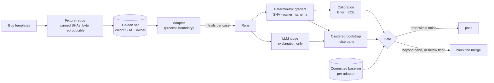

# llm-eval-gate

[](https://github.com/hharshitarora/llm-eval-gate/actions/workflows/eval.yml)

> A CI quality gate for an agent whose output changes between identical runs.

Blocking a merge on a unit test is easy: the test passes or it does not. Blocking
a merge on "the agent got worse" is not, because the agent's score moves on its
own. Score 0.83 today, 0.78 tomorrow, same code. Fail the build on that and
everyone learns to hit rerun until it goes green, and the gate is now a
decoration that costs money.

This is a working answer to that problem, pointed at
[incident-triage-agent](https://github.com/hharshitarora/incident-triage-agent):
an agent that reads a crash log, walks git history, and names the commit that
caused the incident.

## How it works



The system under test sits behind a process boundary and is never imported, so
the same graders work against any agent that can print a JSON object.

## What it looks like when it fires

```
========================================================================
  EVAL GATE: BLOCKED
========================================================================
  mock:degraded  |  12 cases x 5 trials  |  judge: heuristic
------------------------------------------------------------------------
  metric           value  baseline     band   verdict
  completed        1.000     1.000        -   ok    no regression
  suspect_sha      0.450         -        -   FAIL  below hard floor 0.550
  explanation      0.762     0.888    0.198   ok    within noise
  owner            0.450     0.800    0.267   FAIL  regressed 0.350 against a noise band of 0.267
  brier            0.386     0.035    0.030   FAIL  above hard ceiling 0.250
  ece              0.405     0.125    0.050   FAIL  above hard ceiling 0.200
------------------------------------------------------------------------
  judge/oracle kappa: 0.310   brier: 0.386   ece: 0.405
  latency p50/p95: 9.3s / 12.5s   cost: $0.5640
========================================================================
```

Exit code 1, merge blocked, and every failing line says what moved, by how much,
and how much movement was considered normal.

> These numbers come from the built-in `mock:degraded` profile, a synthetic
> agent used to prove the gate bites. For the real measurement, see below.

## The whole point: it found a real regression in a real agent

This exists to grade
[incident-triage-agent](https://github.com/hharshitarora/incident-triage-agent),
which I also wrote. Twelve cases, three trials each, `gpt-4o` for the agent and
`gpt-4o-mini` as judge.

**First run. Blocked.**

```
  metric           value   verdict
  completed        1.000   ok
  suspect_sha      0.417   FAIL  below hard floor 0.550
  explanation      0.778   ok
  owner            0.583   ok
  brier            0.418   FAIL  worse than answering 50% every time
  ece              0.439   FAIL  above hard ceiling 0.200
```

The gap between `explanation` 0.778 and `suspect_sha` 0.417 was the clue. The
agent kept describing the right mechanism and naming the wrong commit, so the
failure was not comprehension. It was attribution.

**The cause.** `git_history` ranked candidate commits by date and attached diffs
to the two most recent. The report prompt says *"when a suspect commit includes a
diff, cite the exact change that introduced the bug"*. So whenever any trivial
change landed after the real regression, the culprit's diff was never shown at
all:

```
sha           date        has diff  summary
fdd5dd6b1e    2026-01-05  YES       Bump retries for the worker pool
ebd2f15834    2026-01-04  YES       Document settings defaults
f1f6483e59    2026-01-02  no        Simplify settings access   <- the culprit
```

It was not reasoning badly. It was choosing from the wrong shortlist.

**After ranking by relevance instead of recency.** Same suite, same models.

| Metric | Before | After |
|---|---|---|
| `suspect_sha` | 0.417 | **0.750** |
| `explanation` | 0.778 | 0.861 |
| `owner` | 0.583 | 0.750 |
| `brier` | 0.418 | **0.201** |
| `ece` | 0.439 | **0.144** |
| judge/oracle κ | 0.250 | 0.750 |
| latency p95 | 8.2s | 6.2s |

Gate passes. Four cases flipped from zero to solved: `config_keyerror`,
`none_attributeerror`, `zero_division`, `recursion_base_case`.

### The calibration result is the interesting one

ECE fell from 0.439 to 0.144 and Brier from 0.418 to 0.201, and **nothing about
confidence was touched**. Not the prompt, not a threshold, not a post-hoc
adjustment.

The agent was never badly calibrated in the way that phrase usually means. It was
confidently wrong for a specific, findable reason, and once it could see the
evidence its confidence became warranted. Judge/oracle kappa tripling to 0.750
says the same thing from the other side: explanation quality and attribution
now move together, because both were downstream of the same missing diff.

An accuracy-only gate would have flagged the accuracy and told you nothing about
why. The calibration metrics are what made the failure legible.

### What still fails, and it is not random

| | Solved |
|---|---|
| Traceback names the culprit file (8 cases) | **8 / 8** |
| It does not (4 cases) | **1 / 4** |

All three remaining failures are cases where the log never names the file that
changed: `silent_wrong_total` and `pagination_offset` have no traceback at all,
only a wrong number, and `attribute_rename` raises in the code that *read* the
attribute rather than the module defining it.

That is a clean statement of the ceiling. The agent can follow a traceback to a
commit; it cannot yet reason from a symbol to the module that defines it. That is
the next piece of work, and it is only nameable because the suite separates those
cases deliberately.

**Caveat, stated rather than buried:** the ranking weights were tuned against the
same twelve cases they are scored on. Every rule is a general claim about what
regressions look like (creations are not regressions, deletions matter, the
raising file matters) rather than a patch for a specific case, but that is a
mitigation, not a defence. It is the weakest part of the result.

### It also found three silent bugs before scoring anything

None raised an error. The agent returned a confident, well-written report every
time and had simply lost its evidence on the way there.

1. **Traceback paths were never mapped to repo paths.** `/srv/app/settings.py` in
   a crash log is `app/settings.py` in git, so `git log --` matched nothing and
   exited 0 while doing it.
2. **Every non-zero git exit was labelled "not a git repository"**, including
   `detected dubious ownership`, which sends whoever is debugging to the wrong
   problem.
3. **The demo builder crashed on every re-run on Windows**, leaving a
   half-deleted sandbox that was no longer a git repo. Because that directory
   sits inside the agent's own repo, `rev-parse --is-inside-work-tree` succeeded
   against the *parent*, so the agent silently investigated the wrong project.
   The README's headline example had stopped working with no explanation.

All fixed upstream with regression tests.

## The four things that make it more than a for-loop

### 1. Ground truth is a fact, not a judgement

The golden set is not scraped or hand-labelled. A generator plants a known bug
in a synthetic repo, so the correct answer is a SHA of a commit we wrote
ourselves. Checking accuracy is then a string comparison, not a model call.

The fixtures are byte reproducible. Author, email and commit timestamp are
pinned per commit, global gitconfig is ignored, and line endings are forced, so
every machine produces the same SHAs:

```
config_keyerror        easy   culprit=f1f6483e59 owner=Dana Lee         decoys_after=3 (same-file=1)
split_indexerror       medium culprit=ae5b84ea25 owner=Tom Vance        decoys_after=3 (same-file=1)
none_attributeerror    medium culprit=363c5aaa9e owner=Sofia Klein      decoys_after=2 (same-file=1)
zero_division          medium culprit=e99dd2e745 owner=Elena Duarte     decoys_after=3 (same-file=1)
type_error_concat      easy   culprit=f095179388 owner=Nils Berger      decoys_after=2 (same-file=0)
silent_wrong_total     hard   culprit=dcb3be7233 owner=Grace Oyelaran   decoys_after=3 (same-file=1)
import_rename          medium culprit=e0a77bcc02 owner=Ines Duarte      decoys_after=3 (same-file=0)
attribute_rename       medium culprit=233f3b414c owner=Lena Fischer     decoys_after=2 (same-file=0)
regex_tightened        medium culprit=98aee058b7 owner=Petra Nowak      decoys_after=2 (same-file=1)
timezone_naive         hard   culprit=aed2ab0e97 owner=Marta Oliveira   decoys_after=2 (same-file=1)
pagination_offset      medium culprit=8581906fad owner=Aoife Brennan    decoys_after=3 (same-file=0)
recursion_base_case    medium culprit=523f07949f owner=Bea Lindgren     decoys_after=2 (same-file=1)
```

CI rebuilds them and fails if a single SHA drifts, because the moment ground
truth moves, every accuracy number ever recorded becomes meaningless.

**The decoy columns are the difficulty knob.** Every case lands commits *after*
the culprit, so "blame the newest commit" scores zero. Most also land a later
commit touching the culprit's own file, so "blame the newest edit to the file in
the traceback" scores zero too. Passing requires reading the diffs.

`silent_wrong_total` is the hard one: no traceback at all, just a failing
assertion and a rounding change two calls away from the reported entry point.

### 2. Deterministic graders first, judge only where it is unavoidable

| Grader | How | Why not an LLM |
|---|---|---|
| `suspect_sha` | exact match against the planted commit | it is a SHA comparison |
| `owner` | culprit commit's author, surname match | it is in the commit metadata |
| `completed` | schema-valid output produced | it is a parse, tracked separately so crashes never hide inside an accuracy average |
| `explanation` | rubric judge, 0 to 3 | genuinely needs reading for meaning |

Reaching for a judge where an equality check would do is how eval suites end up
slow, expensive, and quietly wrong.

### 3. Calibration, because a confidence number should mean something

The agent emits `confidence: 0.0 to 1.0`. Almost nobody checks whether a stated
90% is right 90% of the time, so the field becomes decoration.

Two metrics fix that. **Brier score** is the mean squared error between stated
confidence and what happened (always guessing 50% scores 0.25, so anything worse
is actively misleading). **ECE** isolates the calibration question from raw
accuracy.

This is not academic. In the run above, the degraded agent got *less* accurate
while staying just as confident. An accuracy-only gate with a generous threshold
could have let that through. Brier and ECE both slammed it.

### 4. The judge gets judged

"How do you know your judge is right?" is the question a good reviewer asks, and
usually there is no answer.

Here the judge is scored against the objective signal using Cohen's kappa, and
the number prints on every run. Kappa rather than raw agreement on purpose: when
85% of runs are correct, a judge that says "correct" every time scores 85% raw
agreement while being worthless. Kappa scores it 0.

The heuristic judge in the mock run above scores κ ≈ 0.31. That is poor, not
good, and it is reported rather than buried, because a judge you cannot trust is
a metric you cannot gate on.

## The noise band

The core mechanic. A drop only blocks a merge if it exceeds the run to run noise
of the metric itself.

Noise is measured with a **clustered bootstrap** that resamples *cases*, not
individual runs. Five trials of the same case are five looks at one question and
move together. Treating them as independent observations reports a tighter
interval than the data supports and makes the gate trigger happy. Resampling
whole cases keeps that structure and gives an honestly wider band.

Tolerance for each metric is:

```
max(policy_min_tolerance, baseline_half_width + current_half_width)
```

Two independent ways to block, in [`gate.json`](./gate.json), reviewed like code:

- **absolute bounds** (`floor` / `ceiling`) catch an agent that was always bad,
  including on its first ever run
- **relative regression** catches an agent that was fine yesterday

## Quickstart

No API key. No network. Under five seconds.

```bash
git clone https://github.com/hharshitarora/llm-eval-gate
cd llm-eval-gate
python -m venv .venv && source .venv/bin/activate   # Windows: .venv\Scripts\activate
pip install -r requirements-dev.txt

python -m evalgate build                      # generate fixture repos + dataset
python -m evalgate run                        # run the suite, apply the gate
python -m evalgate run --adapter mock:degraded   # watch it block, exit 1
```

Core dependencies are `pydantic` and `python-dotenv`. The LLM stack is a
separate `requirements-llm.txt` install, so the hermetic path cannot silently
start depending on it.

## Grading a real agent

```bash
pip install -r requirements-llm.txt
cp .env.example .env          # add OPENAI_API_KEY, set TRIAGE_REPO_PATH
python -m evalgate run --adapter triage --judge llm --trials 3
```

The harness never imports the system under test. It starts a process, reads a
JSON object off stdout, and validates it. Pointing this at a different agent is
[one ~50 line adapter](./evalgate/adapters/triage.py), not a refactor.

Baselines are stored per adapter (, )
so a real run is never silently compared against mock numbers. Those measure
different systems, and that comparison is not noisy, it is meaningless.

## Limitations

Stated plainly, because a gate you have wrong confidence in is worse than none.

- **Twelve cases is still a small set.** The clustered bootstrap reports a band
  of about 0.13 on accuracy, so the *relative* check only catches large
  regressions and the absolute floors do most of the work. Doubling the suite
  from six to twelve is what let the decoy hypothesis be tested and rejected, so
  the next doubling is worth more than it sounds. Adding a case is appending a
  template.
- **Synthetic bugs are not production bugs.** They are clean, single commit, and
  Python. Real incidents are messier.
- **The heuristic judge is a proxy.** It measures salient-term recall and cannot
  recognise a correct explanation phrased differently. That is why its kappa is
  printed, and why `--judge llm` exists.
- **Cost is only graded for adapters that report it.** Measuring spend would mean
  instrumenting the system under test, and the whole design depends on not
  reaching inside it.

## Design notes

[`DECISIONS.md`](./DECISIONS.md) covers the trade-offs: why a separate repo, why
process isolation, why the mock adapter exists, and what was deliberately left
out.

## Related

- [incident-triage-agent](https://github.com/hharshitarora/incident-triage-agent)
  is the system under test: a LangGraph agent that traces a production crash to
  the commit that caused it.
